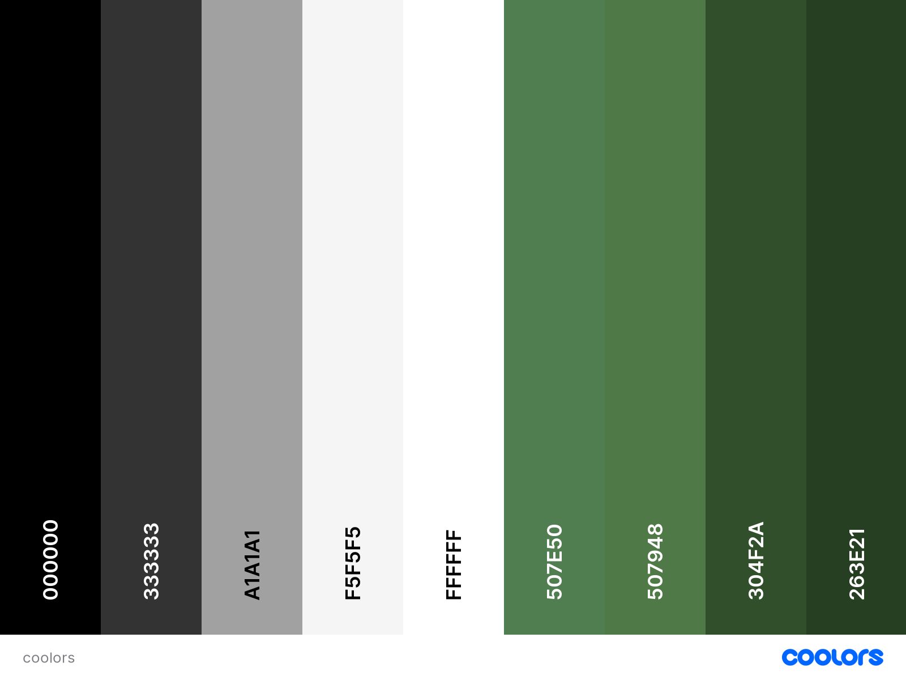

# BUSHY PARK TENNIS CLUB


Bushy Park Tennis Club is a fully functioning web application for a tennis club. The site provides users with all important information about the tennis club, and allows users to easily create personal accounts and profiles, and utilises a fully fleshed-out court reservation system. The site also enables administrators to post news articles to the site, as well as view and make changes to reservations on behalf of users.

## UX

The design philosophy was to create a simple, minimalistic look, which would be in stark contrast to the many cluttered and confusing sports club websites that the user will have undoubtedly come across. Relevant information is presented in a salient and refreshingly clean manner, allowing the user to easily and pleasingly navigate through the site.

### Colour Scheme


The color scheme uses soft white and grey colors, with a strong "tennis style" dark-green accent which is present throughout the site.


I used [coolors.co](https://coolors.co/000000-333333-a1a1a1-f5f5f5-ffffff-507e50-507948-304f2a-263e21) to generate my colour palette.




### Typography

- [Raleway](https://fonts.google.com/specimen/Raleway) was used for the primary headers, titles, and text content.

- [Font Awesome](https://fontawesome.com) icons were used throughout the site, such as the social media icons in the footer.

## User Stories

All user stories can be found in a linked GitHub project [here](https://github.com/users/LewisMDillon/projects/4)


## Features

## Existing Features

### Site Pages

- **Homepage**

    - The main homepage for the site, hero image is large and striking. Large heading tells users they are in the right place. Call to action button to invite users to enter and explore the site.


- **About Page**

    - About page. Gives users essential information about the tennis club. Text content interspersed with pictures helps to break up the page and keep the user engaged with the presented information. 


- **News Page**

    - News Page. Displays news posts made by site staff. User can see the most up-to-date information about events and other things happening at the club. Posts are paginated and displayed in a pleasing layout, utilising images to draw the user in.


- **Contact Page**

    - Contact Page. Users can see contact information for the tennis club, including 
    a contact email address and location information. An embedded Google Maps widget allows users to see the club's exact location.


- **Register Page**

    - Register Page. Displays a form that new users of the site can fill in and make an account. The form is short, simple, and clean to encourage users to use it.


- **Login Page**

    - Login Page. Displays a login form that existing users can use to log in to the site. Two simple input fields for username and password make it easy for users to log in tto their account. A Forgot Password link takes users to another page where they can recover their password. A sign up button at the bottom of the page lets users who do not yet have an account easily find the register page


- **Profile Page**

    - Profile page. Displays a user's profile information. Lets a user see their relevant profile information in a clean and simple way, and contains an update form that users can use to update their profile information.


- **My Reservations Page**

    - My reservations page. Displays a formatted table populated with the user's upcoming court reservations. Users can easily see details of their reservations as well as links to a detail page of each reservation where it can be deleted if the user wishes.


- **Logout Page**

    - Logout Page. A simple page confirming that the user has logged out of their account. Displays a log in again button in case the user wishes to log back in.


- **Reservation Page**

    - Court reservation page. Displays a form for users to reserve a court at the tennis club. The form is simple and easy to use, with only two steps, letting the user quickly and easily make bookings. 


Welcome LewisMDillon,

This is the Code Institute student template for Gitpod. We have preinstalled all of the tools you need to get started. It's perfectly ok to use this template as the basis for your project submissions.

You can safely delete this README.md file, or change it for your own project. Please do read it at least once, though! It contains some important information about Gitpod and the extensions we use. Some of this information has been updated since the video content was created. The last update to this file was: **September 1, 2021**

## Gitpod Reminders

To run a frontend (HTML, CSS, Javascript only) application in Gitpod, in the terminal, type:

`python3 -m http.server`

A blue button should appear to click: _Make Public_,

Another blue button should appear to click: _Open Browser_.

To run a backend Python file, type `python3 app.py`, if your Python file is named `app.py` of course.

A blue button should appear to click: _Make Public_,

Another blue button should appear to click: _Open Browser_.

In Gitpod you have superuser security privileges by default. Therefore you do not need to use the `sudo` (superuser do) command in the bash terminal in any of the lessons.

To log into the Heroku toolbelt CLI:

1. Log in to your Heroku account and go to *Account Settings* in the menu under your avatar.
2. Scroll down to the *API Key* and click *Reveal*
3. Copy the key
4. In Gitpod, from the terminal, run `heroku_config`
5. Paste in your API key when asked

You can now use the `heroku` CLI program - try running `heroku apps` to confirm it works. This API key is unique and private to you so do not share it. If you accidentally make it public then you can create a new one with _Regenerate API Key_.

------

## Release History

We continually tweak and adjust this template to help give you the best experience. Here is the version history:

**September 1 2021:** Remove `PGHOSTADDR` environment variable.

**July 19 2021:** Remove `font_fix` script now that the terminal font issue is fixed.

**July 2 2021:** Remove extensions that are not available in Open VSX.

**June 30 2021:** Combined the P4 and P5 templates into one file, added the uptime script. See the FAQ at the end of this file.

**June 10 2021:** Added: `font_fix` script and alias to fix the Terminal font issue

**May 10 2021:** Added `heroku_config` script to allow Heroku API key to be stored as an environment variable.

**April 7 2021:** Upgraded the template for VS Code instead of Theia.

**October 21 2020:** Versions of the HTMLHint, Prettier, Bootstrap4 CDN and Auto Close extensions updated. The Python extension needs to stay the same version for now.

**October 08 2020:** Additional large Gitpod files (`core.mongo*` and `core.python*`) are now hidden in the Explorer, and have been added to the `.gitignore` by default.

**September 22 2020:** Gitpod occasionally creates large `core.Microsoft` files. These are now hidden in the Explorer. A `.gitignore` file has been created to make sure these files will not be committed, along with other common files.

**April 16 2020:** The template now automatically installs MySQL instead of relying on the Gitpod MySQL image. The message about a Python linter not being installed has been dealt with, and the set-up files are now hidden in the Gitpod file explorer.

**April 13 2020:** Added the _Prettier_ code beautifier extension instead of the code formatter built-in to Gitpod.

**February 2020:** The initialisation files now _do not_ auto-delete. They will remain in your project. You can safely ignore them. They just make sure that your workspace is configured correctly each time you open it. It will also prevent the Gitpod configuration popup from appearing.

**December 2019:** Added Eventyret's Bootstrap 4 extension. Type `!bscdn` in a HTML file to add the Bootstrap boilerplate. Check out the <a href="https://github.com/Eventyret/vscode-bcdn" target="_blank">README.md file at the official repo</a> for more options.

------

## FAQ about the uptime script

**Why have you added this script?**

It will help us to calculate how many running workspaces there are at any one time, which greatly helps us with cost and capacity planning. It will help us decide on the future direction of our cloud-based IDE strategy.

**How will this affect me?**

For everyday usage of Gitpod, it doesn’t have any effect at all. The script only captures the following data:

- An ID that is randomly generated each time the workspace is started.
- The current date and time
- The workspace status of “started” or “running”, which is sent every 5 minutes.

It is not possible for us or anyone else to trace the random ID back to an individual, and no personal data is being captured. It will not slow down the workspace or affect your work.

**So….?**

We want to tell you this so that we are being completely transparent about the data we collect and what we do with it.

**Can I opt out?**

Yes, you can. Since no personally identifiable information is being captured, we'd appreciate it if you let the script run; however if you are unhappy with the idea, simply run the following commands from the terminal window after creating the workspace, and this will remove the uptime script:

```
pkill uptime.sh
rm .vscode/uptime.sh
```

**Anything more?**

Yes! We'd strongly encourage you to look at the source code of the `uptime.sh` file so that you know what it's doing. As future software developers, it will be great practice to see how these shell scripts work.

---

Happy coding!
