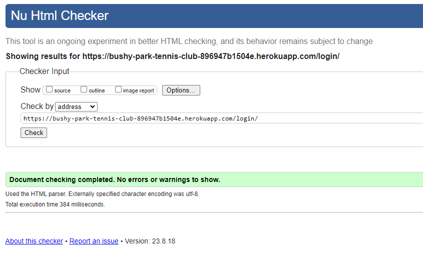
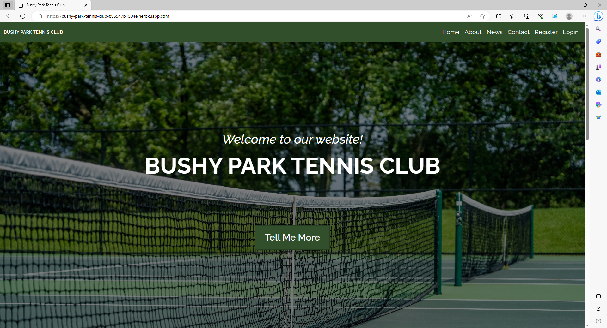
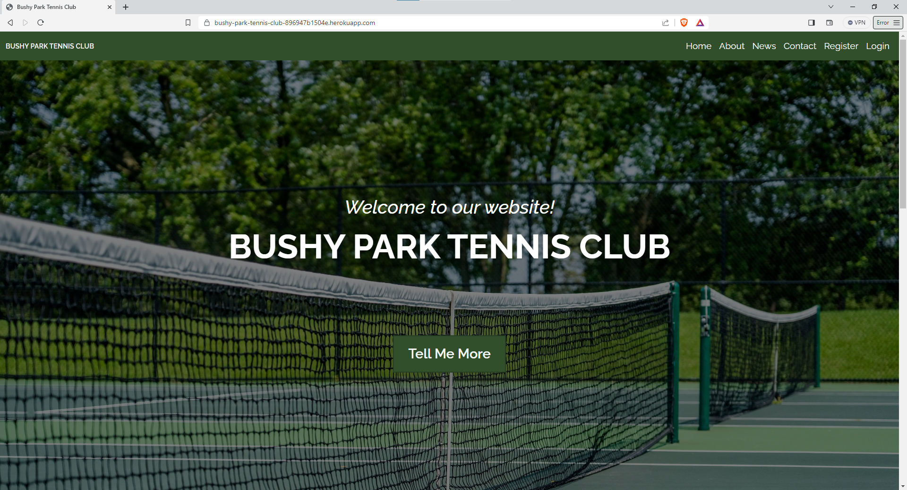
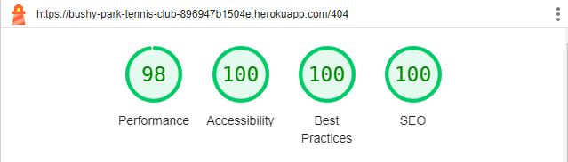

# Testing

Return back to the [README.md](README.md) file.

## Code Validation

### HTML

I have used the recommended [HTML W3C Validator](https://validator.w3.org) to validate all of my HTML files.

| Page | W3C URL | Screenshot | Notes |
| --- | --- | --- | --- |
| Home | [W3C](https://validator.w3.org/nu/?doc=https%3A%2F%2Fbushy-park-tennis-club-896947b1504e.herokuapp.com%2F) |  | Pass: No Errors |
| About | [W3C](https://validator.w3.org/nu/?doc=https%3A%2F%2Fbushy-park-tennis-club-896947b1504e.herokuapp.com%2F) |  | Pass: No Errors |
| News | [W3C](https://validator.w3.org/nu/?doc=https%3A%2F%2Fbushy-park-tennis-club-896947b1504e.herokuapp.com%2F) |  | Pass: No Errors |
| Contact | [W3C](https://validator.w3.org/nu/?doc=https%3A%2F%2Fbushy-park-tennis-club-896947b1504e.herokuapp.com%2F) |  | Pass: No Errors |
| Base | [W3C](https://validator.w3.org/nu/?doc=https%3A%2F%2Fbushy-park-tennis-club-896947b1504e.herokuapp.com%2F) |  | Pass: No Errors |
| Post-Detail | [W3C](https://validator.w3.org/nu/?doc=https%3A%2F%2Fbushy-park-tennis-club-896947b1504e.herokuapp.com%2F) |  | Pass: No Errors |
| Post-Form | [W3C](https://validator.w3.org/nu/?doc=https%3A%2F%2Fbushy-park-tennis-club-896947b1504e.herokuapp.com%2F) |  | Pass: No Errors |
| Post-Confirm-Delete | [W3C](https://validator.w3.org/nu/?doc=https%3A%2F%2Fbushy-park-tennis-club-896947b1504e.herokuapp.com%2F) |  | Pass: No Errors |
| Custom Error 400 | [W3C](https://validator.w3.org/nu/?doc=https%3A%2F%2Fbushy-park-tennis-club-896947b1504e.herokuapp.com%2F) |  | Pass: No Errors |
| Custom Error 403 | [W3C](https://validator.w3.org/nu/?doc=https%3A%2F%2Fbushy-park-tennis-club-896947b1504e.herokuapp.com%2F) |  | Pass: No Errors |
| Custom Error 404 | [W3C](https://validator.w3.org/nu/?doc=https%3A%2F%2Fbushy-park-tennis-club-896947b1504e.herokuapp.com%2F) |  | Pass: No Errors |
| Custom Error 500 | [W3C](https://validator.w3.org/nu/?doc=https%3A%2F%2Fbushy-park-tennis-club-896947b1504e.herokuapp.com%2F) |  | Pass: No Errors |
| Login | [W3C](https://validator.w3.org/nu/?doc=https%3A%2F%2Fbushy-park-tennis-club-896947b1504e.herokuapp.com%2F) |  | Pass: No Errors |
| Logout | [W3C](https://validator.w3.org/nu/?doc=https%3A%2F%2Fbushy-park-tennis-club-896947b1504e.herokuapp.com%2F) |  | Pass: No Errors |
| Profile | [W3C](https://validator.w3.org/nu/?doc=https%3A%2F%2Fbushy-park-tennis-club-896947b1504e.herokuapp.com%2F) |  | Pass: No Errors |
| Register | [W3C](https://validator.w3.org/nu/?doc=https%3A%2F%2Fbushy-park-tennis-club-896947b1504e.herokuapp.com%2F) |  | Pass: No Errors |
| Password-Reset | [W3C](https://validator.w3.org/nu/?doc=https%3A%2F%2Fbushy-park-tennis-club-896947b1504e.herokuapp.com%2F) |  | Pass: No Errors |
| Password-Reset-Confirm | [W3C](https://validator.w3.org/nu/?doc=https%3A%2F%2Fbushy-park-tennis-club-896947b1504e.herokuapp.com%2F) |  | Pass: No Errors |
| Password-Reset-Done | [W3C](https://validator.w3.org/nu/?doc=https%3A%2F%2Fbushy-park-tennis-club-896947b1504e.herokuapp.com%2F) |  | Pass: No Errors |
| Password-Reset-Complete | [W3C](https://validator.w3.org/nu/?doc=https%3A%2F%2Fbushy-park-tennis-club-896947b1504e.herokuapp.com%2F) |  | Pass: No Errors |
| Reservation-List | [W3C](https://validator.w3.org/nu/?doc=https%3A%2F%2Fbushy-park-tennis-club-896947b1504e.herokuapp.com%2F) |  | Pass: No Errors |
| Reservation-User-List | [W3C](https://validator.w3.org/nu/?doc=https%3A%2F%2Fbushy-park-tennis-club-896947b1504e.herokuapp.com%2F) |  | Pass: No Errors |
| Reservation-Detail | [W3C](https://validator.w3.org/nu/?doc=https%3A%2F%2Fbushy-park-tennis-club-896947b1504e.herokuapp.com%2F) |  | Pass: No Errors |
| Reservation-Date | [W3C](https://validator.w3.org/nu/?doc=https%3A%2F%2Fbushy-park-tennis-club-896947b1504e.herokuapp.com%2F) |  | Pass: No Errors |
| Reservation-Form | [W3C](https://validator.w3.org/nu/?doc=https%3A%2F%2Fbushy-park-tennis-club-896947b1504e.herokuapp.com%2F) |  | Pass: No Errors |
| Reservation-Confirm-Delete | [W3C](https://validator.w3.org/nu/?doc=https%3A%2F%2Fbushy-park-tennis-club-896947b1504e.herokuapp.com%2F) |  | Pass: No Errors |

### CSS

I have used the recommended [CSS Jigsaw Validator](https://jigsaw.w3.org/css-validator) to validate all of my CSS files.

| File | Jigsaw URL | Screenshot | Notes |
| --- | --- | --- | --- |
| style.css | [Jigsaw](https://jigsaw.w3.org/css-validator/validator?uri=https%3A%2F%2Fbushy-park-tennis-club-896947b1504e.herokuapp.com%2F&profile=css3svg&usermedium=all&warning=1&vextwarning=&lang=en) |  | Pass: No Errors |

### JavaScript

I have used the recommended [JShint Validator](https://jshint.com) to validate all of my JS files.

| File | Screenshot | Notes |
| --- | --- | --- |
| scripts.js |  | Pass: No Errors |
| date.js |  | Pass: No Errors |
| profile.js |  | Pass: No Errors |

### Python

I have used the recommended [PEP8 CI Python Linter](https://pep8ci.herokuapp.com) to validate all of my Python files.

#### Validation For Tennisclub App
| File | CI URL | Screenshot | Notes |
| --- | --- | --- | --- |
| asgi.py | [PEP8 CI]() |  | Pass: No Errors |
| settings.py | [PEP8 CI]() |  | Pass: No Errors |
| urls.py | [PEP8 CI]() |  | Pass: No Errors |
| views.py | [PEP8 CI]() |  | Pass: No Errors |
| wsgi.py | [PEP8 CI]() |  | Pass: No Errors |

#### Validation For Users App
| File | CI URL | Screenshot | Notes |
| --- | --- | --- | --- |
| admin.py | [PEP8 CI]() |  | Pass: No Errors |
| apps.py | [PEP8 CI]() |  | Pass: No Errors |
| forms.py | [PEP8 CI]() |  | Pass: No Errors |
| models.py | [PEP8 CI]() |  | Pass: No Errors |
| signals.py | [PEP8 CI]() |  | Pass: No Errors |
| tests.py | [PEP8 CI]() |  | Pass: No Errors |
| views.py | [PEP8 CI]() |  | Pass: No Errors |

#### Validation For Website App
| File | CI URL | Screenshot | Notes |
| --- | --- | --- | --- |
| admin.py | [PEP8 CI]() |  | Pass: No Errors |
| apps.py | [PEP8 CI]() |  | Pass: No Errors |
| models.py | [PEP8 CI]() |  | Pass: No Errors |
| tests.py | [PEP8 CI]() |  | Pass: No Errors |
| urls.py | [PEP8 CI]() |  | Pass: No Errors |
| views.py | [PEP8 CI]() |  | Pass: No Errors |

#### Validation For Reservations App
| File | CI URL | Screenshot | Notes |
| --- | --- | --- | --- |
| admin.py | [PEP8 CI]() |  | Pass: No Errors |
| apps.py | [PEP8 CI]() |  | Pass: No Errors |
| models.py | [PEP8 CI]() |  | Pass: No Errors |
| tests.py | [PEP8 CI]() |  | Pass: No Errors |
| urls.py | [PEP8 CI]() |  | Pass: No Errors |
| views.py | [PEP8 CI]() |  | Pass: No Errors |

## Browser Compatibility

I've tested my deployed project on multiple browsers to check for compatibility issues.

| Browser | Screenshot | Notes |
| --- | --- | --- |
| Chrome |  | Works as expected |
| Firefox |  | Works as expected |
| Edge |  | No smooth-scrolling |
| Safari |  | Works as expected |
| Brave |  | No smooth-scrolling |
| Opera |  | No smooth-scrolling |
| Internet Explorer |  | Multiple broken elements |

## Responsiveness

I've tested my deployed project on multiple devices to check for responsiveness issues.

| Device | Screenshot | Notes |
| --- | --- | --- |
| Mobile (DevTools) |  | Works as expected |
| Tablet (DevTools) |  | Works as expected |
| Desktop |  | Works as expected |
| XL Monitor |  | Scaling starts to have minor issues |
| 4K Monitor |  | Noticeable scaling issues |
| Oneplus Nord2 |  | Works as expected |
| iPhone 14 |  | Works as expected |

## Lighthouse Audit

I've tested my deployed project using the Lighthouse Audit tool to check for any major issues.

### Website App Templates - Mobile Testing
| Page | Size | Screenshot | Notes |
| --- | --- | --- | --- |
| Home | Mobile |  | Some minor performance warnings |
| About | Mobile |  | Some minor performance warnings |
| News | Mobile |  | Warning about link text (ignored as link is a Bootstrap button) |
| Contact | Mobile |  | Some minor performance warnings |
| Base | Mobile |  | Some minor performance warnings |
| Post-Detail | Mobile |  | Some minor performance warnings |
| Post-Form | Mobile |  | Some minor performance warnings |
| Post-Confirm-Delete | Mobile |  | Some minor performance warnings |
| Custom Error 400 | Mobile |  | Some minor performance warnings |
| Custom Error 403 | Mobile |  | Some minor performance warnings |
| Custom Error 404 | Mobile |  | Some minor performance warnings |
| Custom Error 500 | Mobile |  | Some minor performance warnings |

### Website App Templates - Desktop Testing
| Page | Size | Screenshot | Notes |
| --- | --- | --- | --- |
| Home | Desktop |  | Some minor performance warnings |
| About | Desktop |  | Some minor performance warnings |
| News | Desktop |  | Warning about link text (ignored as link is a Bootstrap button) |
| Contact | Desktop |  | No warnings |
| Base | Desktop |  | No warnings |
| Post-Detail | Desktop |  | No warnings |
| Post-Form | Desktop |  | No warnings |
| Post-Confirm-Delete | Desktop |  | No warnings |
| Custom Error 400 | Desktop |  | No warnings |
| Custom Error 403 | Desktop |  | No warnings |
| Custom Error 404 | Desktop |  | No warnings |
| Custom Error 500 | Desktop |  | No warnings |

### Users App Templates - Mobile Testing
| Page | Size | Screenshot | Notes |
| --- | --- | --- | --- |
| Login | Mobile |  | Some minor performance warnings |
| Logout | Mobile |  | Some minor performance warnings |
| Register | Mobile |  | Some minor performance warnings |
| Profile | Mobile |  | Some minor performance warnings |
| Password reset | Mobile |  | Some minor performance warnings |
| Password reset-done | Mobile |  | Some minor performance warnings |
| Password reset-confirm | Mobile |  | Some minor performance warnings |
| Password reset-complete | Mobile |  | Some minor performance warnings |

### Users App Templates - Desktop Testing
| Page | Size | Screenshot | Notes |
| --- | --- | --- | --- |
| Login | Desktop |  | No warnings |
| Logout | Desktop |  | No warnings |
| Register | Desktop |  | Minor performance warnings |
| Profile | Desktop |  | No warnings |
| Password reset | Desktop |  | No warnings |
| Password reset-done | Desktop |  | No warnings |
| Password reset-confirm | Desktop |  | No warnings |
| Password reset-complete | Desktop |  | No warnings |
| x | x | x | repeat for any other tested pages/sizes |

