# Testing

Return back to the [README.md](README.md) file.

## Code Validation

### HTML

I have used the recommended [HTML W3C Validator](https://validator.w3.org) to validate all of my HTML files.

| Page | W3C URL | Screenshot | Notes |
| --- | --- | --- | --- |
| Home | [W3C](https://validator.w3.org/nu/?doc=https%3A%2F%2Fbushy-park-tennis-club-896947b1504e.herokuapp.com%2F) |  | Pass: No Errors |
| About | [W3C](https://validator.w3.org/nu/?doc=https%3A%2F%2Fbushy-park-tennis-club-896947b1504e.herokuapp.com%2F) |  | Pass: No Errors |
| News | [W3C](https://validator.w3.org/nu/?doc=https%3A%2F%2Fbushy-park-tennis-club-896947b1504e.herokuapp.com%2F) |  | Pass: No Errors |
| Contact | [W3C](https://validator.w3.org/nu/?doc=https%3A%2F%2Fbushy-park-tennis-club-896947b1504e.herokuapp.com%2F) |  | Pass: No Errors |
| Base | [W3C](https://validator.w3.org/nu/?doc=https%3A%2F%2Fbushy-park-tennis-club-896947b1504e.herokuapp.com%2F) |  | Pass: No Errors |
| Post-Detail | [W3C](https://validator.w3.org/nu/?doc=https%3A%2F%2Fbushy-park-tennis-club-896947b1504e.herokuapp.com%2F) |  | Pass: No Errors |
| Post-Form | [W3C](https://validator.w3.org/nu/?doc=https%3A%2F%2Fbushy-park-tennis-club-896947b1504e.herokuapp.com%2F) |  | Pass: No Errors |
| Post-Confirm-Delete | [W3C](https://validator.w3.org/nu/?doc=https%3A%2F%2Fbushy-park-tennis-club-896947b1504e.herokuapp.com%2F) |  | Pass: No Errors |
| Custom Error 400 | [W3C](https://validator.w3.org/nu/?doc=https%3A%2F%2Fbushy-park-tennis-club-896947b1504e.herokuapp.com%2F) |  | Pass: No Errors |
| Custom Error 403 | [W3C](https://validator.w3.org/nu/?doc=https%3A%2F%2Fbushy-park-tennis-club-896947b1504e.herokuapp.com%2F) |  | Pass: No Errors |
| Custom Error 404 | [W3C](https://validator.w3.org/nu/?doc=https%3A%2F%2Fbushy-park-tennis-club-896947b1504e.herokuapp.com%2F) |  | Pass: No Errors |
| Custom Error 500 | [W3C](https://validator.w3.org/nu/?doc=https%3A%2F%2Fbushy-park-tennis-club-896947b1504e.herokuapp.com%2F) | 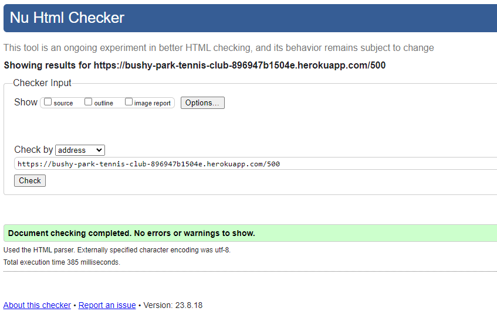 | Pass: No Errors |
| Login | [W3C](https://validator.w3.org/nu/?doc=https%3A%2F%2Fbushy-park-tennis-club-896947b1504e.herokuapp.com%2F) |  | Pass: No Errors |
| Logout | [W3C](https://validator.w3.org/nu/?doc=https%3A%2F%2Fbushy-park-tennis-club-896947b1504e.herokuapp.com%2F) |  | Pass: No Errors |
| Profile | [W3C](https://validator.w3.org/nu/?doc=https%3A%2F%2Fbushy-park-tennis-club-896947b1504e.herokuapp.com%2F) |  | Pass: No Errors |
| Register | [W3C](https://validator.w3.org/nu/?doc=https%3A%2F%2Fbushy-park-tennis-club-896947b1504e.herokuapp.com%2F) |  | Pass: No Errors |
| Password-Reset | [W3C](https://validator.w3.org/nu/?doc=https%3A%2F%2Fbushy-park-tennis-club-896947b1504e.herokuapp.com%2F) |  | Pass: No Errors |
| Password-Reset-Confirm | [W3C](https://validator.w3.org/nu/?doc=https%3A%2F%2Fbushy-park-tennis-club-896947b1504e.herokuapp.com%2F) |  | Pass: No Errors |
| Password-Reset-Done | [W3C](https://validator.w3.org/nu/?doc=https%3A%2F%2Fbushy-park-tennis-club-896947b1504e.herokuapp.com%2F) |  | Pass: No Errors |
| Password-Reset-Complete | [W3C](https://validator.w3.org/nu/?doc=https%3A%2F%2Fbushy-park-tennis-club-896947b1504e.herokuapp.com%2F) |  | Pass: No Errors |
| Reservation-List | [W3C](https://validator.w3.org/nu/?doc=https%3A%2F%2Fbushy-park-tennis-club-896947b1504e.herokuapp.com%2F) |  | Pass: No Errors |
| Reservation-User-List | [W3C](https://validator.w3.org/nu/?doc=https%3A%2F%2Fbushy-park-tennis-club-896947b1504e.herokuapp.com%2F) |  | Pass: No Errors |
| Reservation-Detail | [W3C](https://validator.w3.org/nu/?doc=https%3A%2F%2Fbushy-park-tennis-club-896947b1504e.herokuapp.com%2F) |  | Pass: No Errors |
| Reservation-Date | [W3C](https://validator.w3.org/nu/?doc=https%3A%2F%2Fbushy-park-tennis-club-896947b1504e.herokuapp.com%2F) |  | Pass: No Errors |
| Reservation-Form | [W3C](https://validator.w3.org/nu/?doc=https%3A%2F%2Fbushy-park-tennis-club-896947b1504e.herokuapp.com%2F) |  | Pass: No Errors |
| Reservation-Confirm-Delete | [W3C](https://validator.w3.org/nu/?doc=https%3A%2F%2Fbushy-park-tennis-club-896947b1504e.herokuapp.com%2F) |  | Pass: No Errors |

### CSS

I have used the recommended [CSS Jigsaw Validator](https://jigsaw.w3.org/css-validator) to validate all of my CSS files.

| File | Jigsaw URL | Screenshot | Notes |
| --- | --- | --- | --- |
| style.css | [Jigsaw](https://jigsaw.w3.org/css-validator/validator?uri=https%3A%2F%2Fbushy-park-tennis-club-896947b1504e.herokuapp.com%2F&profile=css3svg&usermedium=all&warning=1&vextwarning=&lang=en) |  | Pass: No Errors |

### JavaScript

I have used the recommended [JShint Validator](https://jshint.com) to validate all of my JS files.

| File | Screenshot | Notes |
| --- | --- | --- |
| scripts.js |  | Pass: No Errors |
| date.js |  | Pass: No Errors |
| profile.js |  | Pass: No Errors |

### Python

I have used the recommended [PEP8 CI Python Linter](https://pep8ci.herokuapp.com) to validate all of my Python files.

#### Validation For Tennisclub App
| File | CI URL | Screenshot | Notes |
| --- | --- | --- | --- |
| asgi.py | [PEP8 CI]() |  | Pass: No Errors |
| settings.py | [PEP8 CI]() |  | Pass: No Errors |
| urls.py | [PEP8 CI]() |  | Pass: No Errors |
| views.py | [PEP8 CI]() |  | Pass: No Errors |
| wsgi.py | [PEP8 CI]() |  | Pass: No Errors |

#### Validation For Users App
| File | CI URL | Screenshot | Notes |
| --- | --- | --- | --- |
| admin.py | [PEP8 CI]() |  | Pass: No Errors |
| apps.py | [PEP8 CI]() |  | Pass: No Errors |
| forms.py | [PEP8 CI]() |  | Pass: No Errors |
| models.py | [PEP8 CI]() |  | Pass: No Errors |
| signals.py | [PEP8 CI]() |  | Pass: No Errors |
| tests.py | [PEP8 CI]() |  | Pass: No Errors |
| views.py | [PEP8 CI]() |  | Pass: No Errors |

#### Validation For Website App
| File | CI URL | Screenshot | Notes |
| --- | --- | --- | --- |
| admin.py | [PEP8 CI]() |  | Pass: No Errors |
| apps.py | [PEP8 CI]() |  | Pass: No Errors |
| models.py | [PEP8 CI]() |  | Pass: No Errors |
| tests.py | [PEP8 CI]() |  | Pass: No Errors |
| urls.py | [PEP8 CI]() |  | Pass: No Errors |
| views.py | [PEP8 CI]() |  | Pass: No Errors |

#### Validation For Reservations App
| File | CI URL | Screenshot | Notes |
| --- | --- | --- | --- |
| admin.py | [PEP8 CI]() |  | Pass: No Errors |
| apps.py | [PEP8 CI]() |  | Pass: No Errors |
| models.py | [PEP8 CI]() |  | Pass: No Errors |
| tests.py | [PEP8 CI]() |  | Pass: No Errors |
| urls.py | [PEP8 CI]() |  | Pass: No Errors |
| views.py | [PEP8 CI]() |  | Pass: No Errors |

## Browser Compatibility

I've tested my deployed project on multiple browsers to check for compatibility issues.

| Browser | Screenshot | Notes |
| --- | --- | --- |
| Chrome |  | Works as expected |
| Firefox |  | Works as expected |
| Edge |  | No smooth-scrolling |
| Safari |  | Works as expected |
| Brave |  | No smooth-scrolling |
| Opera |  | No smooth-scrolling |
| Internet Explorer |  | Multiple broken elements |

## Responsiveness

I've tested my deployed project on multiple devices to check for responsiveness issues.

| Device | Screenshot | Notes |
| --- | --- | --- |
| Mobile (DevTools) |  | Works as expected |
| Tablet (DevTools) |  | Works as expected |
| Desktop |  | Works as expected |
| XL Monitor |  | Scaling starts to have minor issues |
| 4K Monitor |  | Noticeable scaling issues |
| Oneplus Nord2 |  | Works as expected |
| iPhone 14 |  | Works as expected |

## Lighthouse Audit

I've tested my deployed project using the Lighthouse Audit tool to check for any major issues.

### Website App Templates - Mobile Testing
| Page | Size | Screenshot | Notes |
| --- | --- | --- | --- |
| Home | Mobile |  | Some minor performance warnings |
| About | Mobile |  | Some minor performance warnings |
| News | Mobile |  | Warning about link text (ignored as link is a Bootstrap button) |
| Contact | Mobile |  | Some minor performance warnings |
| Base | Mobile |  | Some minor performance warnings |
| Post-Detail | Mobile |  | Some minor performance warnings |
| Post-Form | Mobile |  | Some minor performance warnings |
| Post-Confirm-Delete | Mobile |  | Some minor performance warnings |
| Custom Error 400 | Mobile |  | Some minor performance warnings |
| Custom Error 403 | Mobile |  | Some minor performance warnings |
| Custom Error 404 | Mobile |  | Some minor performance warnings |
| Custom Error 500 | Mobile |  | Some minor performance warnings |

### Website App Templates - Desktop Testing
| Page | Size | Screenshot | Notes |
| --- | --- | --- | --- |
| Home | Desktop |  | Some minor performance warnings |
| About | Desktop |  | Some minor performance warnings |
| News | Desktop |  | Warning about link text (ignored as link is a Bootstrap button) |
| Contact | Desktop |  | No warnings |
| Base | Desktop |  | No warnings |
| Post-Detail | Desktop |  | No warnings |
| Post-Form | Desktop |  | No warnings |
| Post-Confirm-Delete | Desktop |  | No warnings |
| Custom Error 400 | Desktop |  | No warnings |
| Custom Error 403 | Desktop |  | No warnings |
| Custom Error 404 | Desktop |  | No warnings |
| Custom Error 500 | Desktop |  | No warnings |

### Users App Templates - Mobile Testing
| Page | Size | Screenshot | Notes |
| --- | --- | --- | --- |
| Login | Mobile |  | Some minor performance warnings |
| Logout | Mobile |  | Some minor performance warnings |
| Register | Mobile |  | Some minor performance warnings |
| Profile | Mobile |  | Some minor performance warnings |
| Password reset | Mobile | 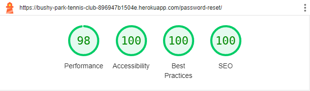 | Some minor performance warnings |
| Password reset-done | Mobile |  | Some minor performance warnings |
| Password reset-confirm | Mobile |  | Some minor performance warnings |
| Password reset-complete | Mobile |  | Some minor performance warnings |

### Users App Templates - Desktop Testing
| Page | Size | Screenshot | Notes |
| --- | --- | --- | --- |
| Login | Desktop |  | No warnings |
| Logout | Desktop |  | No warnings |
| Register | Desktop |  | Minor performance warnings |
| Profile | Desktop |  | No warnings |
| Password reset | Desktop |  | No warnings |
| Password reset-done | Desktop |  | No warnings |
| Password reset-confirm | Desktop |  | No warnings |
| Password reset-complete | Desktop |  | No warnings |

### Reservations App Templates - Mobile Testing
| Page | Size | Screenshot | Notes |
| --- | --- | --- | --- |
| Reservation List | Mobile |  | Some minor performance warnings |
| Reservation User List | Mobile |  | Warning about link text (ignored as link is a Bootstrap button) |
| Reservation Detail | Mobile |  | Some minor performance warnings |
| Rservation Confirm Delete | Mobile |  | Some minor performance warnings |
| Reservation Date | Mobile |  | Some minor performance warnings |
| Reservation Form | Mobile |  | Some minor performance warnings |

### Reservations App Templates - Desktop Testing
| Page | Size | Screenshot | Notes |
| --- | --- | --- | --- |
| Reservation List | Desktop |  | Minor performance warnings |
| Reservation User List | Desktop |  | Warning about link text (ignored as link is a Bootstrap button) |
| Reservation Detail | Desktop |  | No warnings |
| Rservation Confirm Delete | Desktop |  | No warnings |
| Reservation Date | Desktop |  | No warnings |
| Reservation Form | Desktop |  | No warnings |

## Defensive Programming

Defensive programming was manually tested with the below user acceptance testing:

| Page | User Action | Expected Result | Pass/Fail | Comments |
| --- | --- | --- | --- | --- |
| Nav links | | | | |
| | Click on Logo | Redirection to Home page | Pass | |
| | Click on Home link in navbar | Redirection to Home page | Pass | |
| | Click on About link in navbar | Redirection to About page | Pass | |
| | Click on News link in navbar | Redirection to News page | Pass | |
| | Click on Contact link in navbar | Redirection to Contace page | Pass | |
| | Click on Register link in navbar | Redirection to Register page | Pass | |
| | Click on Login link in navbar | Redirection to Login page | Pass | |
| | Click on My Account - My Profile link in navbar | Redirection to User Profile page | Pass | |
| | Click on My Account - My Reservations link in navbar | Redirection to User Reservation List | Pass | |
| | Click on My Account - Logout link in navbar | Log out & Redirection to Logout page | Pass | |
| News Page | | | | |
| | Click on Read More button on post | Redirection to that post details page | Pass | |
| | Click on post title | Redirection to that post details page | Pass | |
| | Click on Pagination nav number | Redirection to that pagination page | Pass | |
| | Click on Pagination right arrow | Redirection to next pagination page | Pass | |
| | Click on Pagination double right arrow | Redirection to last pagination page | Pass | |
| | Click on Pagination left arrow | Redirection to previous pagination page | Pass | |
| | Click on Pagination double left arrow | Redirection to first pagination page | Pass | |
| Register | | | | |
| | Enter valid email address | Field will only accept email address format | Pass | |
| | Enter valid password (twice) | Field will only accept password format | Pass | |
| | Click on Sign Up button | Redirects user to blank Login page | Pass |
| Log In | | | | |
| | Enter valid password | Field will only accept password format | Pass | |
| | Click Login button | Redirects user to home page | Pass | |
| Log Out | | | | |
| | Click Logout button | Logs out user, Redirects user to logout page | Pass |
| Profile | | | | |
| | Click on the Edit Profile button | Edit profile form appears | Pass | |
| | Click on the Upcoming reservations link | Redirects to user reservation list | Pass | |
| | Users cannot visit other user's profiles |  Redirects user back to own profile | Pass |
| User Reservation List | | | | |
| | Click on the new reservation - click here button | Redirect to Reservation Form | Pass | |
| | Click on view in the reservation list | Redirects to that reservation's details | Pass | |
| Reservation Details | | | | |
| | Click on cancel reservation button | Redirect to deletion confirmation page | Pass | |
| | Click on back button | Redirect to reservation list page | Pass | |
| Reservation Delete Confirm | | | | |
| | Click on cancel reservation button | Delete reservation, display message, redirect to reservation list | Pass | |
| | Click on back button | Redirect to reservation details page | Pass | |
| Site Navigations - Logged Out User | | | | |
| | Navigate to any login required URL | Redirect to login page, redirect back after login | Pass | |
| Nav links - Admin | | | | |
| | Click on Admin - New Post link in navbar | Log out & Redirection to Logout page | Pass | |
| | Click on Admin - Reservations link in navbar | Log out & Redirection to Logout page | Pass | |
| New Post - Admin | | | | |
| | Enter Post Title | Field is required | Pass | |
| | Enter Post Subtitle | Field is required | Pass | |
| | Enter Post Content | Field is required | Pass | |
| | Enter Post Image | Default is used if left blank | Pass | |
| Master Reservation List - Admin | | | | |
| | Click on view in the reservation list | Redirects to that reservation's details | Pass | |
| | Enter a date in the date search box | Filter reservations by that date | Pass | |
| | Enter a name in the date search box | Filter reservations by that name | Pass | |
| Reservation Details - Admin| | | | |
| | Click on cancel reservation button | Can view/delete other users' reservations | Pass |
| | Click on back button | Redirect to reservation list page | Pass | |

## User Story Testing

| User Story | Screenshot |
| --- | --- |
| As a user I can view the site so that I can learn about the tennis club |  |
| As a user I can access different areas of the site depending on whether I am logged in or not. so that I do not engage with site functionalities that require an account, if I do not have one. | 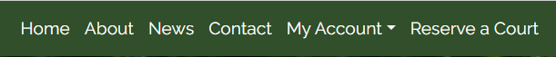 |
| As a user I can create a personalized user profile so that I can see my user details and other personalized information. | 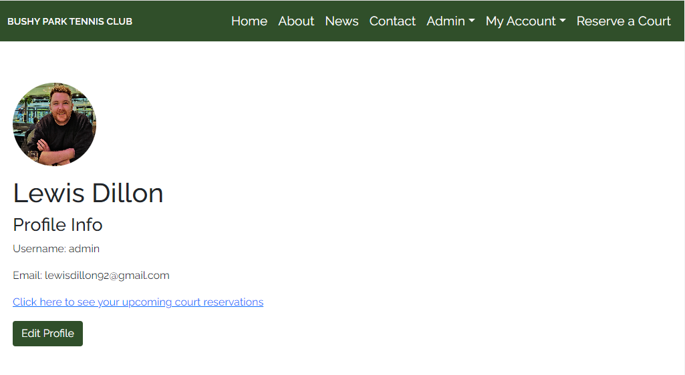 |
| As a user I can see different site navigation links when I am logged in so that I can easily access areas of the site that require login, and do not see confusing 'login' links when already logged in. |  |
| As a user I can navigate around different pages in the site so that I can see the relevant information in an organised manner |  |
| As a user I can create a secure account so that I can have a personal presence on the site, as well as access any account-based functionalities | 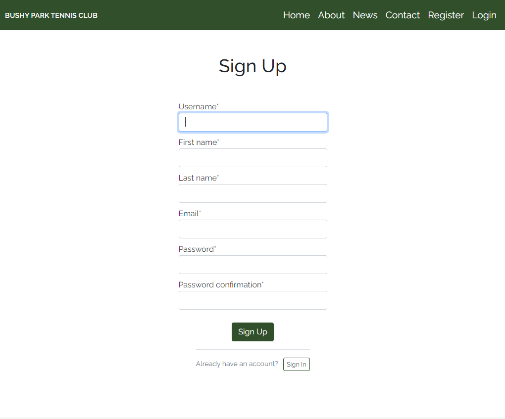 |
| As a user I can see the user sign in page when I try to access 'logged-in-only' site pages or functionalities so that I can quickly and easily log in and then continue with my intended use of the site. | 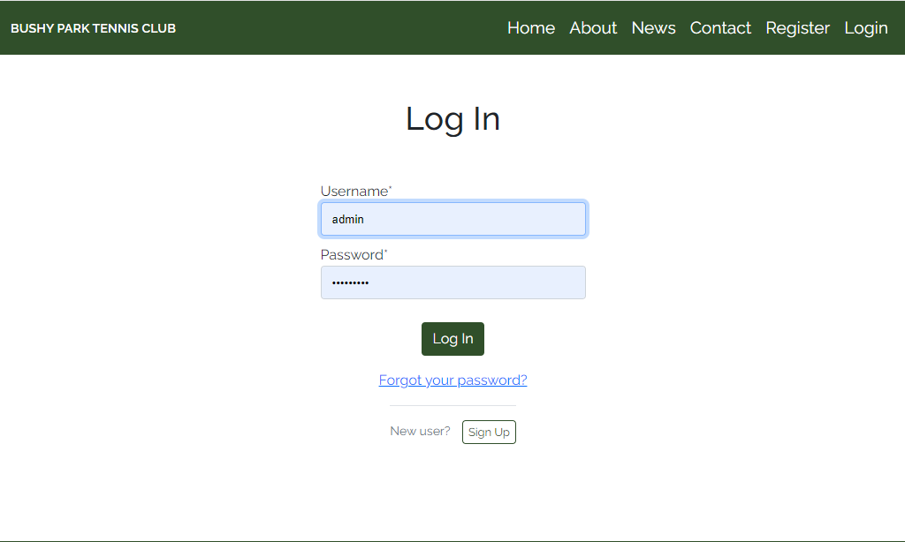 |
| As a user I can book a tennis court via the booking system so that I can easily reserve a time slot in which to play tennis at the club |  |
| As a user I can see a visual representation of all available and unavailable timeslots so that I can, at a glance, see what times are free to book | 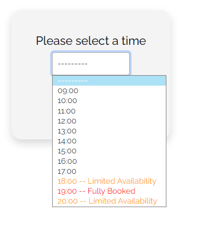 |
| As a user I can see a paginated list of site posts so that I see only the most up-to-date posts and can navigate to older posts if I wish | |
| As a user I can delete my existing booking so that I can easily cancel a reserved time slot, should I need to | 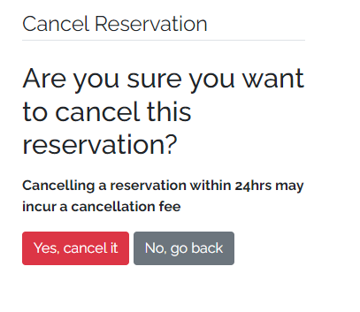 |
| As a user I can reset my account password so that I can retain access to my account, even if I forget my password. |  |
| As an account holder I can update my profile information so that my profile is personalized and contains accurate information | 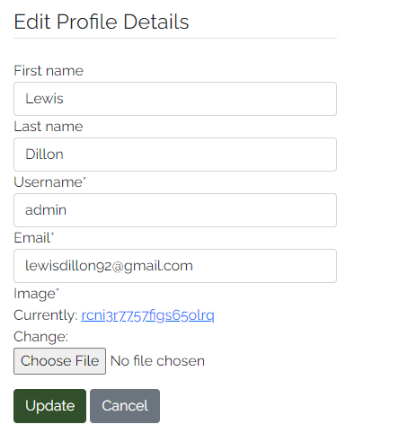 |
| As an account holder I can upload a profile picture so that my profile is personalised to me and is recognisable at a glance |  |
| As an account holder I can update or remove my profile picture so that my profile stays current to my preferences |  |
| As an account holder I can logout so that access to my account is stopped and my information is kept secure |  |
| As an account holder I can login to the site so that I can access account-based functionalities and info |  |
| As an administrator I can update select site content via a back end interface so that I can add and remove content from the site, without engaging with the site's code |  |
| As an administrator I can update site content via a front-end interface so that I can edit certain sections of the site in a user-friendly and repeatable way | 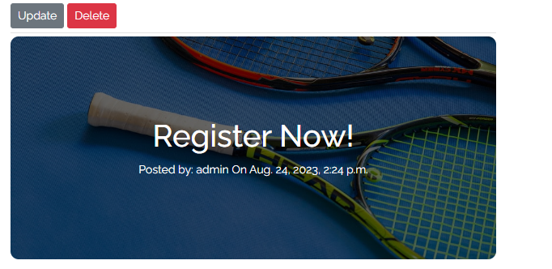 |
| As an administrator I can update users' privileges so that I can allow/restrict users' and staff engagement with the back end of the site |  |
| As an administrator I can send emails to users automatically so that the user can receive confirmation and other emails, without having to manually send these out. |  | 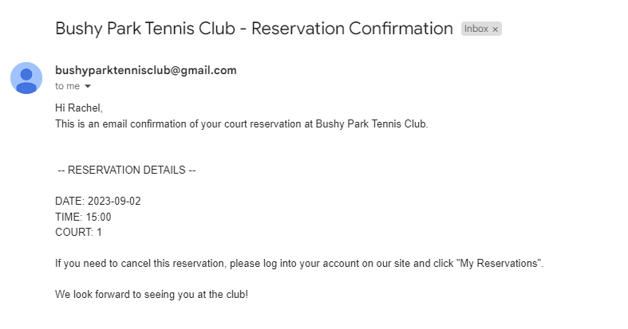 |
| As an administrator I can create my own, or view/edit/delete users' court bookings so that I have complete control over the booking system, and can help users to manage their bookings |  |
| As an administrator I can encrypt users' passwords so that the passwords remain secure and unexploitable by anyone with access to the back end of the site |  |
| As an administrator I can create/edit users so that I can test various functionalities of the site, as well as troubleshoot problems a specific user may have. |  |

## Automated Testing

### Python (Unit Testing)

I have used Django's built-in unit testing framework to test the application functionality.

In order to run the tests, I ran the following command in the terminal each time:

`python3 manage.py test name-of-app `

To create the coverage report, I would then run the following commands:

`coverage run --source=name-of-app manage.py test`

`coverage report`

To see the HTML version of the reports, and find out whether some pieces of code were missing, I ran the following commands:

`coverage html`

`python3 -m http.server`

Below are the results from the various apps on my application that I've tested:

| App | File | Coverage | Screenshot |
| --- | --- | --- | --- |
| Users | tests.py | 99% |  |
| Reservations | tests.py | 89% |  |
| Website | tests.py | 97% |  |

